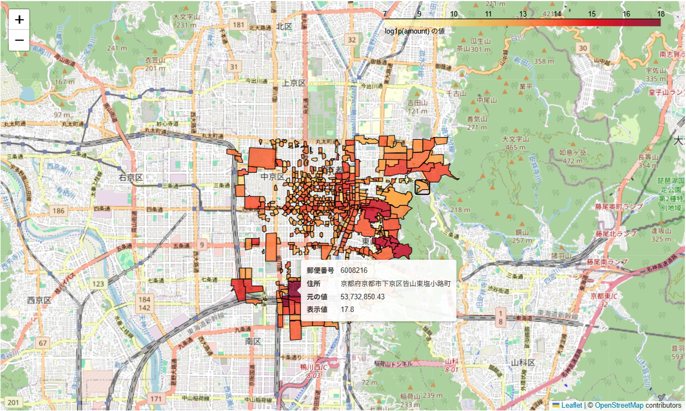

# 京都市中心エリアの消費傾向の可視化

## 概要

本リポジトリでは、クレジットカード決済データをもとに、京都市内の地域別消費傾向を可視化した。消費者の性別・年代・居住地・業種といった要因ごとの傾向を地図上に表示することで、地域特性を直感的に把握できることを目的としている。

可視化にはFoliumを用い、ブラウザ上での動的な地図表示を実現した。

## 技術スタック

- Python 3.x
- pandas / numpy
- folium / branca
- geopandas
- jupyter notebook

## デモ

下図は、2023年1月1日から2023年12月31日における東京都からの来訪者の総消費額を地理的に色分けした例である。



マウスオーバーにより、町丁目ごとの詳細な情報（郵便番号・住所・消費額・対数変換済みの消費額）を表示できる。

## ディレクトリ構成

```plaintext
kyoto-consumption-map/
├── data/
│   ├── dummy_data/
│   │   ├── dummy_data.csv
│   │   └── generate_dummy.py
│   └── geojson/
│       └── 京都市中心GeoJSONデータ_v3.geojson
│
├── notebooks/
│   ├── analysis.ipynb
│   └── local_map.html
│
├── screenshots/
│   └── map.png
│
├── src/
│   ├── aggregate.py
│   ├── classify.py
│   ├── filter.py
│   ├── heatmap.py
│   ├── preprocess.py
│   ├── visualize.py
│   └── visualize_tool.py
│
├── requirements.txt
└── README.md
```

## 実行方法

Jupyter Notebookを起動し、notebooks/analysis.ipynb を開くことで可視化処理を再現可能である。

補足事項:データはすべてダミー化済みであり、個人情報を含まない。

分析対象の元データからサンプルとして3万件を使用している。

データ生成手順は data/dummy_data/generate_dummy.py に記載している。
